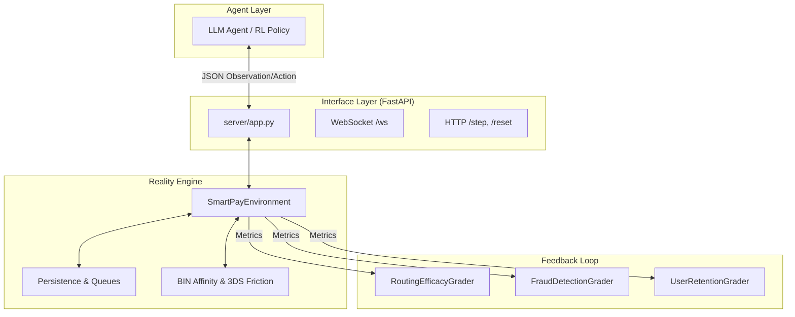

# 💳 SmartPayEnv: Advanced Fintech Reality Layer

**A high-fidelity, production-grade benchmark for training and evaluating AI Agents (LLMs/RL) on the messy reality of global payment orchestration.**

[](https://huggingface.co/spaces/Pratap-K/SmartPayEnv)
[](https://github.com/meta-pytorch/OpenEnv)

SmartPayEnv bridges the gap between simple simulations and production fintech. It models the adversarial loops, infrastructure instability, and delayed feedback cycles that define modern payment systems.

---

## 🚀 Why SmartPayEnv?

In the real world, payment orchestration isn't just about "Allow" or "Block." It's about optimizing for **Conversion**, **Fraud Risk**, and **Operational Cost** simultaneously. SmartPayEnv introduces:

- **Delayed Credit Assignment**: Undetected fraud today becomes a Chargeback 40 steps later.
- **Conversion Friction**: Security measures (3DS) can cause high-value users to abandon their carts.
- **Gateway Drift**: Provider success rates fluctuate based on bank-level performance and network drift.

---

## 🏗️ System Architecture

SmartPayEnv leverages the **OpenEnv** framework to provide a standardized interface for AI agents.



---

## 🌊 The Payment Lifecycle (The Reality Loop)

The environment models a high-frequency feedback loop where agents navigate noisy signals and delayed consequences.

```mermaid
sequenceDiagram
    autonumber
    participant Agent as AI Agent (LLM/RL)
    participant Env as Reality Engine
    participant Queue as Review/CB Queues

    Note over Env: [State] Clock advances + Events Triggered
    Env->>Agent: Observation (Noisy Risk + Lagged Health + Resolution Alerts)
    
    Note over Agent: [Inference] Is there a fraud spike or gateway outage?
    Agent->>Env: Action (Gateway Strategy + Fraud Decision)

    rect rgb(30, 30, 30)
        Note over Env: [Reality] Execution & Scheduling
        Env->>Env: Success = f(Health, BIN, TrueRisk, Noise)
        Env->>Queue: Schedule Reviews (10s) and Chargebacks (40s)
    end

    Queue-->>Env: Matured Results from previous steps
    Env->>Agent: Feedback (Reward, Done, Resolved Alerts)
```



---

## 💎 Advanced Reality Features

### 1. Log-Driven Time-Series
Sequentially streams from synthetic logs to simulate real-world distributions, diurnal cycles (simulation clock), and persistent fraud surges.

### 2. Partial Observability
Forces agents to infer state by adding noise to risk signals, hiding internal user tiers, and lagging gateway health metrics by 2 steps.

### 3. Human-in-the-Loop (HITL)
Agents can send transactions to manual review (Action 3). Resolutions are 100% accurate but incur a $5.00 fee and a 10-25 step delay.

### 4. Advanced Adversarial Mechanics
- **🛡️ 3DS Friction (Action 2)**: Provides a **90% fraud reduction** but triggers a **15-25% abandonment rate**. Agents must balance security vs. customer drop-off.
- **⏳ Delayed Chargebacks**: Undetected fraud ($TrueRisk > 0.65$) matures into penalties (Tx Amount + $20 fee) **30-50 steps later**, forcing long-term liability management.
- **📊 BIN-Gateway Affinity**: A hidden matrix of gateway performance across different card types. Agents must discover these affinities to optimize routing success.

---

## 🎯 Benchmark Tasks

SmartPayEnv supports four curriculum tasks, ranging from basic classification to complex joint optimization.

| Task | Level | Objective | Metrics |
|------|-------|-----------|---------|
| `routing_efficacy` | Easy | Choose the gateway (0-2) with the highest affinity for the current card BIN. | Routing Score |
| `user_retention` | Medium| Minimize customer churn by ensuring high availability for premium/existing users. | Retention Score |
| `fraud_detection` | Medium| Correctily identify and block (`action=1`) fraudulent transactions based on risk signals. | MCC Score |
| `payment_optimization`| Hard | **Joint Equilibrium**: Optimize routing success, fraud mitigation, and user retention simultaneously. | Combined Reward |

---

## 📐 Exhaustive Grader Documentation

Our graders utilize a **Deterministic Mathematical Framework** to provide stable gradients for agent training.

### 1. Routing Efficacy Grader
Grades the quality of the gateway choice and transaction outcome.
- **Formula**: $Reward = \sigma(\alpha \cdot (2E - 1) - (\beta \cdot Cost + \gamma \cdot Retries) + \delta \cdot Quality)$
- **Key Parameters**:
    - **$\alpha$ (Outcome Weight: 1.2)**: Scales the impact of the expected success.
    - **$\beta$ (Cost Multiplier: 0.15)**: Penalizes choosing expensive gateways.
    - **$\gamma$ (Retry Penalty: 0.4)**: Discourages excessive retries.
    - **$\delta$ (Decision Bonus: 0.8)**: Rewards selecting the gateway with the highest current affinity.

### 2. Fraud Detection Grader (MCC)
Uses the **Matthews Correlation Coefficient (MCC)** to handle imbalanced transaction data (fraud is rare, ~2%).
- **MCC Formula**:
$$MCC = \frac{TP \times TN - FP \times FN}{\sqrt{(TP + FP)(TP + FN)(TN + FP)(TN + FN)}}$$
- **Reward Mapping**: Maps MCC $[-1, 1]$ to a learnable range $[0, 1]$ using $R = \frac{MCC + 1}{2}$. A baseline of $0.5$ represents a random classifier.

### 3. User Retention Grader
Models customer churn using an **Exponential Hazard Function** to simulate the "Trust Deficit."
- **Retention Formula**:
$$Retention = e^{-\lambda \cdot f^2}$$
where $f$ is the count of consecutive failed transactions for that user cohort.
- **Rationale**: Consecutive failures cause non-linear churn; a first failure is an annoyance, but a third consecutive failure leads to near-certain platform abandonment.

---

## 📐 Data Models

### Action Space (`SmartpayenvAction`)
| Field | Type | Values | Description |
|-------|------|--------|-------------|
| `gateway` | `int` | `0, 1, 2` | 0=Economy, 1=Standard, 2=Premium |
| `fraud_decision`| `int` | `0, 1, 2, 3`| 0=Allow, 1=Block, 2=3DS (Challenge), 3=Manual Review |
| `retry_strategy`| `int` | `0, 1` | 0=No Retry, 1=Auto-Failover |

### Observation Space (`SmartpayenvObservation`)
| Category | Field | Description |
|----------|-------|-------------|
| **Context** | `amount` | Transaction value in USD |
| | `bin_category` | Card type (0-9) |
| | `user_segment` | 0=New, 1=Existing, 2=Premium |
| **Signals** | `observed_fraud_risk`| Noisy risk probability [0,1] |
| | `time_of_day` | Current simulation hour (0-23) |
| **Reviews**| `review_resolutions`| List of matured manual review results |
| **Health** | `gateway_states` | LAGGED Health status (2 steps delay) |
| | `gateway_success_rates`| LAGGED success probabilities |
| **Tracking**| `chargeback_penalty_applied`| Penalty from a past undetected fraud |

---

## 🏗️ Step-by-Step Setup

### 1. Local Development
We recommend using [uv](https://github.com/astral-sh/uv) for fast, reliable dependency management.

```bash
# Clone and enter the repository
git clone https://github.com/pratap-nitjsr/SmartPayEnv.git
cd SmartPayEnv

# Install dependencies
uv sync

# Run the OpenEnv validation suite
openenv validate

# Run core logic tests
python tests/test_reality_features.py
```

### 2. Starting the Server
```bash
# Run via uv
uv run -m SmartPayEnv.server.app
```
Access the **Swagger UI** at `http://localhost:7860/` (auto-redirects to `/docs`).

### 3. Multi-Mode Deployment (Docker)
```bash
# Build the production image
docker build -t smartpay-env .

# Run the container
docker run -p 7860:7860 smartpay-env
```

---

## 📁 Project Structure
```text
SmartPayEnv/
├── scripts/
│   ├── generate_logs.py         # Synthetic dataset generator
├── data/
│   ├── transactions_log.jsonl   # Pre-generated transaction pool
├── server/
│   ├── app.py                  # FastAPI Entry Point (Uvicorn)
│   ├── SmartPayEnv_environment.py # Core Reality Layer Logic
│   ├── graders.py               # Math models for RL Reward
│   └── utils.py                 # Log loading & sampling utilities
├── tests/
│   ├── test_graders.py         # Unit tests for scoring math
│   ├── test_reality_features.py # Reality layer verification
│   └── test_env_logs.py        # Log-driven simulation test
├── models.py                   # Pydantic Action/Observation Schemas
├── inference.py                # LLM/RL Agent Driver & Curriculum
├── pyproject.toml              # Dependency & Build Manifest
└── openenv.yaml                # OpenEnv Environment Metadata
```

## 📄 License
This project is licensed under the MIT License - see the [LICENSE](file:///d:/meta-pytorch-final/SmartPayEnv/LICENSE) file for details.

