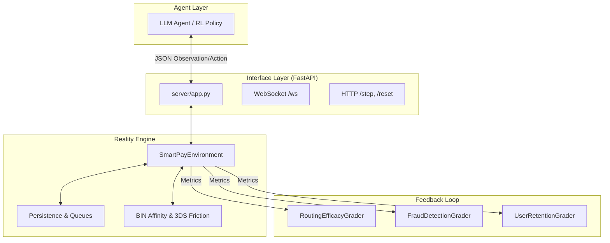

# 💳 SmartPayEnv: Advanced Fintech Reality Layer

**A high-fidelity, production-grade benchmark for training and evaluating AI Agents (LLMs/RL) on the messy reality of global payment orchestration.**

[](https://huggingface.co/spaces/Pratap-K/SmartPayEnv)
[](https://github.com/meta-pytorch/OpenEnv)

SmartPayEnv bridges the gap between simple simulations and production fintech. It models the adversarial loops, infrastructure instability, and delayed feedback cycles that define modern payment systems.

---

## 🚀 Why SmartPayEnv?

In the real world, payment orchestration isn't just about "Allow" or "Block." It's about optimizing for **Conversion**, **Fraud Risk**, and **Operational Cost** simultaneously. SmartPayEnv introduces:

- **Delayed Credit Assignment**: Undetected fraud today becomes a Chargeback 40 steps later.
- **Conversion Friction**: Security measures (3DS) can cause high-value users to abandon their carts.
- **Gateway Drift**: Provider success rates fluctuate based on bank-level performance and network drift.

---

## 🏗️ System Architecture

SmartPayEnv leverages the **OpenEnv** framework to provide a standardized interface for AI agents.



---

## 🌊 The Payment Lifecycle (with LLM Context)

The core interaction loop models an AI Agent acting as a **Smart Router and Risk Engine**.

```mermaid
sequenceDiagram
    autonumber
    participant LLM as LLM Agent (Decision Maker)
    participant Env as Environment (Reality Layer)
    participant CB as Chargeback Maturity Queue

    Env->>LLM: Observation: {BIN: 4111, Amount: $500, UserSegment: New, ...}
    
    Note over LLM: Agent analyzes fraud signals vs. BIN affinity
    LLM->>Env: Action: {gateway: 1, fraud_decision: 2} (3DS Challenge)
    
    rect rgb(50, 50, 50)
    Note over Env: Reality Simulation
    Env->>Env: Apply 15% User Abandonment (Friction)
    Env->>Env: Calculate Success (Gateway 1 Rate * BIN 4111 Affinity)
    end

    Env-->>LLM: Step Outcome: Reward, Done, chargeback_penalty=0
    
    Note over Env,CB: 30-50 Transactions Later...
    CB->>Env: Fraud Detected from Step 1
    Env-->>LLM: Next Observation: {chargeback_penalty_applied: $520.00}
```



---

## 🎯 Benchmark Tasks

SmartPayEnv supports three core curriculum tasks, ranging from basic classification to complex joint optimization.

| Task | Level | Objective | Metrics |
|------|-------|-----------|---------|
| `routing_efficacy` | Easy | Choose the gateway (0-2) with the highest affinity for the current card BIN. | Routing Score |
| `fraud_detection` | Medium| Correctily identify and block (`action=1`) fraudulent transactions based on risk signals. | MCC Score |
| `user_retention` | Medium| Minimize customer churn by ensuring high availability for premium/existing users. | Retention Score |
| `payment_optimization`| Hard | **Joint Equilibrium**: Optimize routing success, fraud mitigation, and user retention simultaneously. | Combined Reward |

---

## 📐 Exhaustive Grader Documentation

Our graders utilize a **Deterministic Mathematical Framework** to provide stable gradients for agent training.

### 1. Routing Efficacy Grader
Grades the quality of the gateway choice and transaction outcome.
- **Formula**: $Reward = \sigma(\alpha \cdot (2E - 1) - (\beta \cdot Cost + \gamma \cdot Retries) + \delta \cdot Quality)$
- **Key Parameters**:
    - **$\alpha$ (Outcome Weight: 1.2)**: Scales the impact of the expected success.
    - **$\beta$ (Cost Multiplier: 0.15)**: Penalizes choosing expensive gateways (Fixed + % Fees).
    - **$\gamma$ (Retry Penalty: 0.4)**: Discourages excessive retries which increase latency.
    - **$\delta$ (Decision Bonus: 0.8)**: Rewards selecting the gateway with the highest current affinity/rate, even if the transaction fails due to environment noise.


### 2. Fraud Detection Grader (MCC)
Uses the **Matthews Correlation Coefficient (MCC)** to handle imbalanced transaction data.
- **Why?**: In payments, fraud is rare (~2%). Accuracy is a misleading metric; MCC captures the balance between True Positives (blocked fraud) and False Positives (blocked legitimate users).
- **Normalization**: Maps MCC $[-1, 1]$ to a learnable range $[0, 1]$, where $0.5$ represents a random baseline.

### 3. User Retention Grader
Models customer churn using an **Exponential Hazard Function**.
- **Mechanic**: Every failed transaction increments a `consecutive_failures` counter for the user.
- **Hazard Formula**: $1 - e^{-\lambda \cdot (failures^2)}$
- **Rationale**: Models the "Trust Deficit." A first failure is annoying; a third consecutive failure causes **non-linear churn**, reflecting how premium users abandon platforms after bad experiences.

---

## 📐 Data Models

### Action Space (`SmartpayenvAction`)
Decisions submitted by the agent at each step:

| Field | Type | Values | Description |
|-------|------|--------|-------------|
| `gateway` | `int` | `0, 1, 2` | 0=GatewayA (Economy), 1=GatewayB (Standard), 2=GatewayC (Premium) |
| `fraud_decision`| `int` | `0, 1, 2` | 0=Allow, 1=Block (Ends episode), 2=3DS Challenge (Friction) |
| `retry_strategy`| `int` | `0, 1` | 0=No Retry, 1=Auto-Failover to next gateway on failure |

### Observation Space (`SmartpayenvObservation`)
The state provided to the agent for each transaction:

| Category | Field | Values | Description |
|----------|-------|--------|-------------|
| **Context** | `amount` | `float` | Transaction value in USD ($1 - $5000) |
| | `bin_category` | `0-9` | Card type (e.g., 0=Domestic Debit, 5=International Credit) |
| | `user_segment` | `0, 1, 2` | 0=New, 1=Existing, 2=Premium (Lower fraud risk) |
| **Signals** | `fraud_risk_score`| `0..1` | Multi-factor risk probability (higher = more suspicious) |
| | `user_history_score`| `0..1` | Normalized reliability based on previous successful tx |
| **Health** | `gateway_states` | `str[]` | Health status per gateway: `normal`, `degraded`, `recovering` |
| | `gateway_success_rates`| `float[]`| Real-time estimated success probabilities for A, B, and C |
| **Tracking**| `chargeback_penalty_applied`| `float` | Penalty deducted *this step* from a past undetected fraud |
| | `previous_failures`| `int` | Consecutive failures in current cohort session (influences churn) |

---

## 🛠️ Advanced Reality Features

### 🛡️ 3D Secure (3DS) Friction
The `fraud_decision=2` action triggers a 3DS challenge.
- **Security**: Provides a **90% reduction** in fraud risk.
- **Friction**: Triggers a **15% abandonment rate** (User Drop-off). Agents must learn when the transaction value justifies the risk of losing the customer.

### ⏳ Delayed Chargebacks
Undetected fraud ($FraudRisk > 0.65$) incurs a **Chargeback Penalty** that matures **30-50 steps** after the transaction.
- **Impact**: Full transaction amount + $20 chargeback fee.
- **Goal**: Forces agents to balance immediate routing success against long-term liability.

### 📊 BIN-Gateway Affinity
A 10x3 matrix mapping card types (BIN categories) to gateway strengths. 
- Some gateways process "Debit" better, while others are "Premium Credit" specialists.
- Agents must discover these hidden affinities to maximize success rates.

---

## 🏗️ Step-by-Step Setup

### 1. Local Development
We recommend using [uv](https://github.com/astral-sh/uv) for fast, reliable dependency management.

```bash
# Clone and enter the repository
git clone https://github.com/pratap-nitjsr/SmartPayEnv.git
cd SmartPayEnv

# Install dependencies
uv sync

# Run the OpenEnv validation suite
openenv validate

# Run core logic tests
python tests/test_v3_features.py
```

### 2. Starting the Server
```bash
# Run via uv
uv run -m SmartPayEnv.server.app
```
Access the **Swagger UI** at `http://localhost:7860/` (auto-redirects to `/docs`).

### 3. Multi-Mode Deployment (Docker)
```bash
# Build the production image
docker build -t smartpay-env .

# Run the container
docker run -p 7860:7860 smartpay-env
```

---

## 📁 Project Structure
```text
SmartPayEnv/
├── server/
│   ├── app.py                  # FastAPI Entry Point (Uvicorn)
│   ├── SmartPayEnv_environment.py # Core Reality Layer Logic
│   └── graders.py               # Math models for RL Reward
├── tests/
│   ├── test_graders.py         # Unit tests for scoring math
│   └── test_v3_features.py     # Reality layer verification 
├── models.py                   # Pydantic Action/Observation Schemas
├── inference.py                # LLM/RL Agent Driver & Curriculum
├── pyproject.toml              # Dependency & Build Manifest
└── openenv.yaml                # OpenEnv Environment Metadata
```

## 📄 License
This project is licensed under the MIT License - see the [LICENSE](file:///d:/meta-pytorch-final/SmartPayEnv/LICENSE) file for details.

